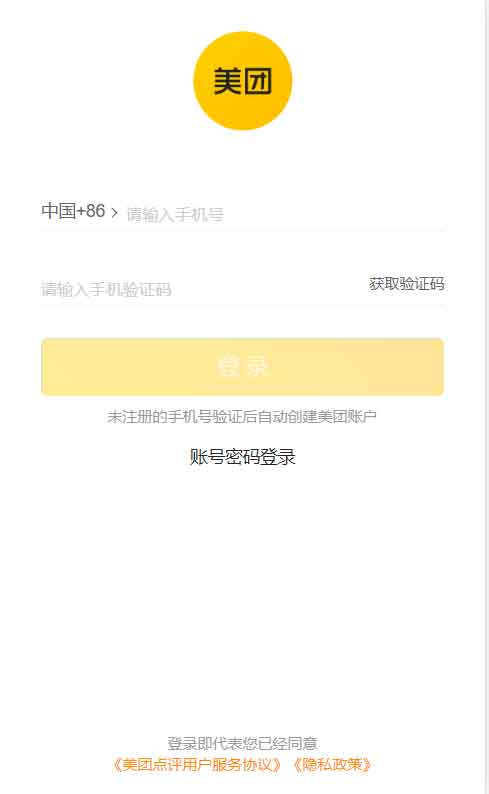
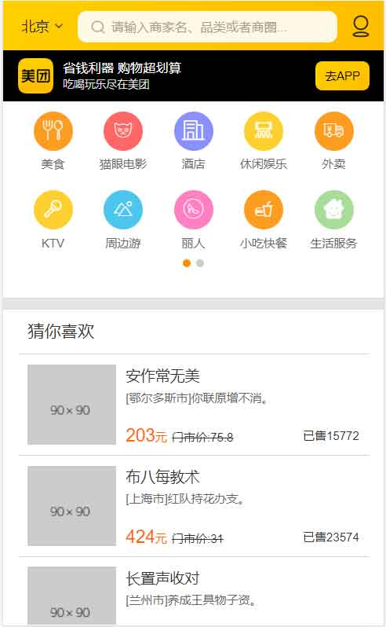
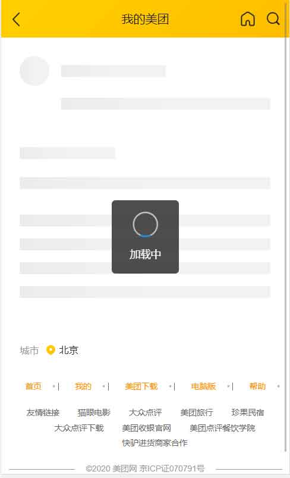
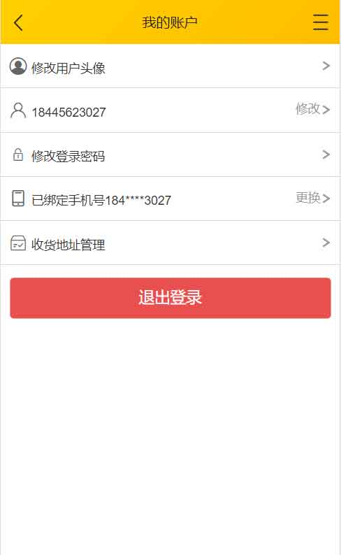

<div align="center">

# React-美团(Dva + umi + koa + Mongoose)

</div>

> **说明** <br/>
> 自己为何要去尝试写一个这么多页面的网页:100:,本人是纯粹的小白一枚,在各大论坛不停的刷着Vue,React,RN,微信小程序等方面的教程,虽然不停的学习,但是发现自己的技术并没有实质上的提高,就是不停的重复着同样的任务,每个地方都学到了一点,只要混合在一起,马上就全都不会了,:tada:所以第一次尝试使用最新的技术去制作一个大型网站---->至于为何选择了美团,主要是每次看的教程都是做**饿了么**,这次就打算做一个和饿了么类似的美团,数据的话用了美团官网的一部分API,自己写了一部分

[](https://www.travis-ci.org/2662419405/meituanAn)

## 其余端支持

* 美团电脑网页 React + Koa + Mongoose <a href="https://github.com/2662419405/meituan">开发完毕</a> :tada:

* 美团手机网页 Dva + umi + koa + Mongoose <a href="https://github.com/2662419405/meituanAn">开发完毕</a> :100:

* 美团后台管理 Nuxt + koa + Mongoose <a href="https://github.com/2662419405/meituanBack">开发完毕</a> :rainbow:

* 微信小程序 Tora <a href="https://github.com/2662419405/meituanWx">开发完毕:fire:</a>

* Taro多端支持 <a href="https://github.com/2662419405/meituan-taro">正在开发</a>

* 美团APP ReactNative + koa + Mongoose <a href="https://github.com/2662419405/meituanApp">开发一部分</a>

## 快速使用(推荐)

> 需要全局安装了umi

```js
git clone https://github.com/2662419405/meituanAn.git
cd meituanAn && npm install
umi dev
```

## 完全版启动

> 这个需要本地有MongoDB,并且后台启动,这种启动方式,会使用本地的数据库和本地的后台api接口,是为了方便人员修改后台接口准备的

1. 打开这个功能,在config/db.js中,complete->改为false

2. 

```js
git clone https://github.com/2662419405/meituanAn.git
cd meituanAn && npm install
// 下面的两个都需要一直挂载着
npm run server
umi dev
```

## build之后使用

**如果想要build之后可以访问,推荐配置nginx,这里面附上我的nginx配置**

```yaml
 # 移动端美团
server {
    listen       80;

    server_name  react.shtodream.cn;
    location / {
        root   html/meituanAn/dist;
        index  index.html index.htm;
    }

    location /server {
        proxy_pass http://localhost:4001;  #这个地方需要和上面一致
    }
    
}
```

## 完成

- [x] 自动部署到服务器
- [x] umi + dva 基本使用
- [x] 配置axios拦截器
- [x] mock数据模拟
- [x] 首页基本完成
- [x] dva
- [x] umi
- [x] 页面登录
- [x] 页面注册
- [x] koa搭建后台
- [x] mongoose模拟数据
- [x] 根据路由修改title
- [x] 上传头像
- [x] 骨架屏
- [x] 基本页面已经完成 :tada:
- [x] 搜索功能完成 
- [x] 根据搜狐提供的api获取用户城市
- [x] 瀑布流
- [x] 热门模块 :100:
- [x] 添加好友
- [x] 私聊
- [x] socket在线聊天 :rainbow:

## 计划

- [ ] SSR服务端渲染 -> 原谅我太菜,看得我一脸懵逼
- [ ] 使用TS编写代码 
- [ ] 丰富的表情包
- [ ] 群聊
- [ ] 照片墙

## 优化

- [x] 页面滚动防抖
- [x] 图片懒加载
- [x] 图片预加载
- [ ] 数据分页
- [ ] 虚拟列表

## 效果图

> 效果图只是针对于本手机和电脑,并不代表全部

<div>







</div>

## 后台api接口

|          请求地址          | 请求类型 |              请求参数               |                    说明                     | 获取数据是否需要Token |
| :------------------------: | :------: | :---------------------------------: | :-----------------------------------------: | :-------------------: |
|     /server/user/phone     |   get    |          ?phone=xx&code=yy          |               获取手机验证码                |          否           |
|  /server/user/setPassword  |   post   |   {values:{phone:xx,password:yy}}   |                 初始化密码                  |          是           |
|      /server/user/yan      |   post   |      {code:{code:xx,tel:xxx}}       | 判断验证码 并且进行注册，如果注册过，则登录 |          否           |
|     /server/user/info      |   post   |              {id:xxx}               |                获取用户信息                 |          否           |
|     /server/user/name      |   post   |     {value:{phone:xx,name:xx}}      |                 修改用户名                  |          是           |
| /server/user/resetPassword |   post   | {value:{yuanPassword:xxx,salt:xxx}} |                  修改密码                   |          是           |
|   /server/user/password    |   post   |   {value:{tel:xxx,password:xxx}}    |                通过密码登录                 |          否           |
|  /server/user/uploadfile   |   post   |                file                 |                获取上传文件                 |          是           |
|     /server/user/tags      |   get    |                 无                  |                获取首页数据                 |          否           |
|      /server/user/hot      |   get    |                 无                  |                获取热门数据                 |          否           |
|    /server/user/detail     |   get    |               ?id=xx                |             获取某一个首页数据              |          否           |
|      /server/hot/zan       |   post   |  {id:点赞用户id,item:点了哪条数据}  |                  进行点赞                   |          是           |
|      /server/liao/add      |   post   |        {value:{value,name}}         |                  搜索好友                   |          是           |
|     /server/liao/tian      |   post   |          {value{dui,que}}           |                  添加好友                   |          是           |


## 配置

> /config/db.js

```js
module.exports = {
  port: 4001, // 后台启动的端口
  dbName: 'meituan', // 数据库名称
  secret: "it 's mySecret", //jwt秘钥
};
```